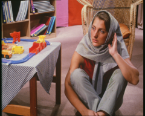

# VRDL_LW4

```sh
python3 tools/gdget.py 1GL_Rh1N-WjrvF_-YOKOyvq0zrV6TF4hb -O dataset.zip
unzip -qq dataset.zip -d ./
rm dataset.zip

mv training_hr_images/training_hr_images/* training_hr_images/
rm -rf training_hr_images/training_hr_images/
mv testing_lr_images/testing_lr_images/* testing_lr_images/
rm -rf testing_lr_images/testing_lr_images/

pip install -r requirements.txt
```


```py
from torchsummary import summary
import torch
torch.cuda.is_available()
for GPU_ID in range(torch.cuda.device_count()):
    print(torch.cuda.get_device_name(GPU_ID))
```

<p style="margin: auto">
    
    
</p>

## Reference

[leftthomas/SRGAN](https://github.com/leftthomas/SRGAN)

[Photo-Realistic Single Image Super-Resolution Using a Generative Adversarial Network](https://arxiv.org/abs/1609.04802)
